# PHASE 1 — SYSTEM ARCHITECTURE / ARCHITECTURE DU SYSTÈME

> **EN** — Enterprise architecture for transforming the ERP/POS prototype
> (frontend HTML/CSS/JS + localStorage) into a **fullstack multi-tenant business
> platform** (ERP + CRM + Budgeting + Accounting + Analytics + Real-time).
> **Scope of this document: Phase 1 only** — prototype analysis + target architecture
> design + diagrams. No project initialization or application code (Phases 2–6).
>
> **FR** — Architecture entreprise pour transformer le prototype ERP/POS
> (frontend HTML/CSS/JS + localStorage) en **plateforme métier fullstack multi-tenant**
> (ERP + CRM + Budgétisation + Comptabilité + Analytique + Temps réel).
> **Périmètre de ce document : Phase 1 uniquement** — analyse du prototype + conception
> de l'architecture cible + diagrammes. Aucune initialisation de projet ni code (Phases 2–6).

---

## CONTENTS / SOMMAIRE

1. [Prototype analysis / Analyse du prototype](#1-prototype-analysis--analyse-du-prototype)
2. [Modules inventory / Inventaire des modules](#2-modules-inventory--inventaire-des-modules)
3. [Entities inventory / Inventaire des entités](#3-entities-inventory--inventaire-des-entités)
4. [Entity relationships / Relations entre entités](#4-entity-relationships--relations-entre-entités)
5. [Business workflows / Workflows métier](#5-business-workflows--workflows-métier)
6. [Module dependencies / Dépendances inter-modules](#6-module-dependencies--dépendances-inter-modules)
7. [Target architecture overview / Architecture cible — vue d'ensemble](#7-target-architecture-overview--architecture-cible--vue-densemble)
8. [Frontend architecture / Architecture frontend](#8-frontend-architecture--architecture-frontend)
9. [Backend architecture / Architecture backend](#9-backend-architecture--architecture-backend)
10. [Database & multi-tenant / Base de données & multi-tenant](#10-database--multi-tenant--base-de-données--multi-tenant)
11. [API architecture / Architecture API](#11-api-architecture--architecture-api)
12. [Auth & permissions (RBAC) / Authentification & permissions](#12-auth--permissions-rbac--authentification--permissions)
13. [Event-driven & real-time / Orientée événements & temps réel](#13-event-driven--real-time--orientée-événements--temps-réel)
14. [Analytics, budgeting & CRM / Analytique, budgétaire & CRM](#14-analytics-budgeting--crm--analytique-budgétaire--crm)
15. [Deployment & DevOps / Déploiement & DevOps](#15-deployment--devops--déploiement--devops)
16. [Additional diagrams / Diagrammes complémentaires](#16-additional-diagrams--diagrammes-complémentaires)
17. [Architecture decisions / Décisions d'architecture](#17-architecture-decisions--décisions-darchitecture)

---

## 1. PROTOTYPE ANALYSIS / ANALYSE DU PROTOTYPE

### 1.1 Technical nature / Nature technique

**EN** — The prototype is a **single-file Single Page Application (SPA)**.
**FR** — Le prototype est une **Single Page Application (SPA) mono-fichier**.

| Aspect | Detail / Détail |
|---|---|
| Single file / Fichier unique | `samplesite.html` (~1145 lines, inline HTML+CSS+JS) |
| Persistence / Persistance | `localStorage`, keys prefixed `ca_` |
| Navigation | Show/hide `<div class="page">` via `goTo()` / `goToParam()` |
| Data model / Modèle | Global JS object `data` hydrated from localStorage |
| Rendering / Rendu | HTML string concatenation (`render*()`) |
| Currency/Lang / Devise/Langue | FR only, `fr-FR`, default currency `FCFA` |
| Security / Sécurité | None / Aucune |
| Multi-user / Multi-utilisateur | None / Aucun |

### 1.2 Strengths to keep / Forces à conserver

- **EN** — Already modular functional split (POS, Sales, Purchases, Stock, light CRM,
  Settings); explicit reusable business logic: TTC calc (`calcTTC`), product code
  generation (`genCode`), stock decrement/increment on sale/purchase, dashboard
  aggregations (`renderDash`); a settings layer (taxes, currencies, payment methods,
  accounting journals, document config, company); an embryonic **RBAC** (users with
  `role` + allowed `modules`).
- **FR** — Découpage fonctionnel déjà modulaire ; logique métier explicite et réutilisable
  (calcul TTC, génération de code produit, mouvements de stock, agrégations du dashboard) ;
  un référentiel de paramétrage ; un embryon de **RBAC** (rôle + modules autorisés).

### 1.3 Blocking limitations / Limites bloquantes

| Limitation | Consequence / Conséquence | Target answer / Réponse cible |
|---|---|---|
| localStorage | Not shared, not backed up, ~5–10MB, lost on cache clear | PostgreSQL + Prisma + backups |
| No backend / Pas de backend | No protected rules, no transactional integrity | NestJS + transactions + server validation |
| base64 photos | localStorage saturation | S3 object storage + URL |
| No auth / Pas d'auth | No confidentiality, no multi-user | JWT + refresh + RBAC |
| Single company / Mono-entreprise | Not SaaS-ready | Multi-tenant (`tenant_id` + RLS) |
| No real-time / Pas de temps réel | Static dashboards | Socket.io + event-driven |
| Denormalized data | `sale.client` stores a **name** not an id ⇒ inconsistencies | Foreign keys + normalization |

> **EN — Key migration finding:** the prototype stores **labels** (client name, payment
> name, journal code) instead of relational **ids**. Phase 3 normalizes this; migration
> strategy in §17.
> **FR — Constat clé :** le prototype stocke des **libellés** au lieu d'**identifiants**.
> La Phase 3 normalisera ; stratégie de migration en §17.

---

## 2. MODULES INVENTORY / INVENTAIRE DES MODULES

| # | Module (FR) | Prototype page | Role / Rôle |
|---|---|---|---|
| 1 | Tableau de bord / Dashboard | `page-dashboard` | Day KPIs, stock alerts, top sales/suppliers |
| 2 | POS / Caisse | `page-caisse` | Quick sale, cart (`receipt`), checkout |
| 3 | Ventes / Sales | `page-ventes` | Sales entry/list |
| 4 | Clients / Customers | `page-clients` | Customer registry |
| 5 | Fournisseurs / Suppliers | `page-fournisseurs` | Supplier registry + stats |
| 6 | Achats / Purchases | `page-achats` | Purchase orders, stock receipt |
| 7 | Stock / Inventory | `page-stocks` | Products, quantities, reorder thresholds |
| 8 | Sociétés / Companies | `page-societes` | Issuing company identity |
| 9 | Utilisateurs & Droits / Users & Rights | `page-utilisateurs` | Accounts, roles, allowed modules |
| 10 | Devises / Currencies | `page-devises` | Main currency + symbol |
| 11 | Taxes (TVA) / Taxes (VAT) | `page-taxes` | Tax rates |
| 12 | Modes de paiement / Payment methods | `page-paiements` | Cash, mobile money, etc. |
| 13 | Journaux comptables / Accounting journals | `page-journaux` | Sales/purchase journals |
| 14 | Configuration documents / Document config | `page-documents` | Invoice/receipt mentions |

**Modules to add / Modules à ajouter** (per instructions): full **CRM** (leads,
opportunities, pipelines, activities, campaigns), **Accounting** (entries, ledger,
trial balance), **real-time Budgeting**, **Forecasting**, **Analytics/BI**,
**Notifications**, **Approval workflows**, **Multi-branch / warehouses**,
**Advanced reporting**, **Audit & activity**.

---

## 3. ENTITIES INVENTORY / INVENTAIRE DES ENTITÉS

### 3.1 Prototype entities / Entités du prototype

> **EN** — Real fields extracted from the `save*()` functions.
> **FR** — Champs réels extraits des fonctions `save*()`.

```text
produit/product   { id, nom, cat, code, photo(base64), prix, achat, taxeId, qty, seuil }
client/customer   { id, nom, tel, email, ville }
fournisseur       { id, nom, contact, tel, email, ville, categorie, delai, statut, notes }
vente/sale        { id, date, client(name!), montant(HT), ttc, taxeId, paiement(name!),
                    journal(code!), articles(text), statut }
achat/purchase    { id, date, fournisseurId, fournisseur(name!), produit(name!), qty,
                    montant, paiement(name!), journal(code!), statut }
taxe/tax          { id, nom, taux, actif }
paiement/payment  { id, nom, actif }
journal           { id, nom, code, type(Ventes|Achats|Les deux), devise, actif }
devise/currency   { id, nom, symbole, principale(bool) }
user              { id, nom, email, role, modules[], statut }
societe/company   { nom, forme, contrib, rccm, tel, email, ville, adresse, slogan, devise }
docConfig         { ...document mentions... }
```

`(name!)` / `(code!)` = denormalized value to normalize into a foreign key on migration.

### 3.2 Target entities / Entités cibles (50 tables — Phase 3)

Grouped by domain (DDD) / Regroupées par domaine :

- **Identity & access / Identité & accès**: `tenant`, `company`, `branch`, `user`,
  `role`, `permission`, `role_permission`, `user_role`, `refresh_token`, `audit_log`,
  `activity_log`.
- **Catalog & stock / Catalogue & stock**: `product`, `category`, `warehouse`,
  `inventory`, `stock_movement`.
- **Sales & POS / Ventes & POS**: `sale`, `sale_line`, `pos_session`, `invoice`,
  `payment`, `payment_method`.
- **Purchases / Achats**: `supplier`, `purchase`, `purchase_line`.
- **Accounting / Comptabilité**: `tax`, `journal`, `account`, `journal_entry`,
  `journal_line`, `transaction`.
- **CRM**: `customer`, `lead`, `opportunity`, `pipeline`, `pipeline_stage`,
  `crm_activity`, `meeting`, `call`, `task`, `note`, `campaign`.
- **Budgeting & finance / Budgétisation & finance**: `budget_plan`, `budget_category`,
  `budget_allocation`, `budget_approval`, `budget_revision`, `forecast`, `cost_center`,
  `department`, `goal`, `cashflow_forecast`.
- **Analytics & BI / Analytique & BI**: `kpi`, `financial_analytics`,
  `revenue_analytics`, `expense_analytics`.
- **Platform / Plateforme**: `notification`, `setting`, `document_config`,
  `approval_workflow`, `realtime_event_log`.

> Full columns/constraints/indexes/ERD → **Phase 3**.

---

## 4. ENTITY RELATIONSHIPS / RELATIONS ENTRE ENTITÉS

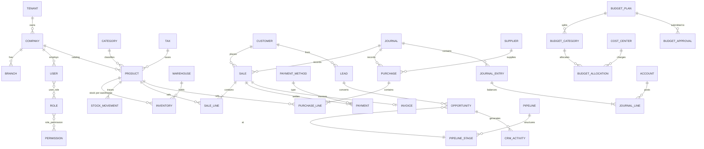

**EN — Key cardinalities:** everything hangs off a `TENANT` (SaaS isolation) then a
`COMPANY`/`BRANCH` (multi-company/branch base). A sale becomes an aggregate
`SALE + SALE_LINE[] + PAYMENT[]` (vs the prototype's text `articles`) enabling per-product
analytics. Stock is split per warehouse (`INVENTORY`) and historized (`STOCK_MOVEMENT`).
Accounting uses double-entry: `JOURNAL_ENTRY ⇒ JOURNAL_LINE[]` (debit/credit) on `ACCOUNT`.

**FR — Cardinalités clés :** tout est rattaché à un `TENANT` puis `COMPANY`/`BRANCH`
(socle multi-entreprises/succursales). Une vente devient l'agrégat
`SALE + SALE_LINE[] + PAYMENT[]` → analytique par produit. Stock éclaté par entrepôt et
historisé. Comptabilité en partie double.

---

## 5. BUSINESS WORKFLOWS / WORKFLOWS MÉTIER

### 5.1 POS sale (central workflow, from `validerVente`) / Vente au POS

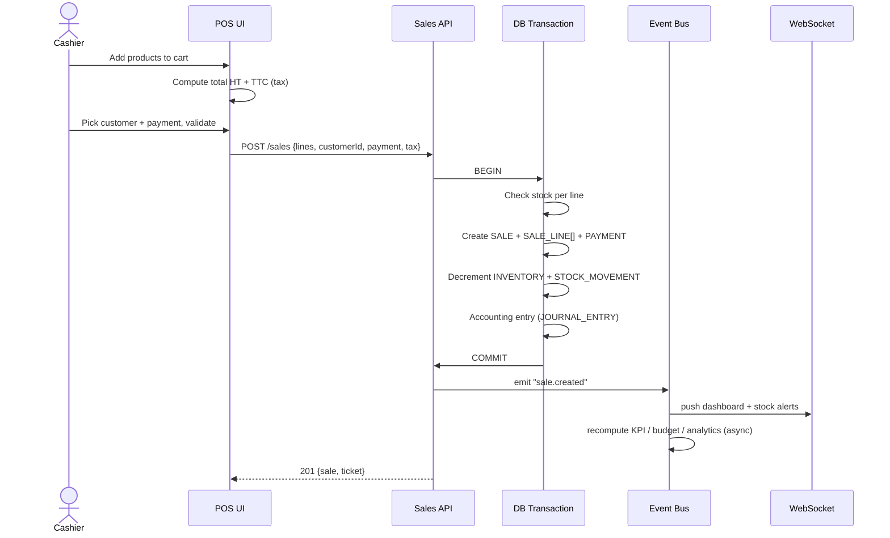

### 5.2 Other prototype workflows / Autres workflows

| Workflow | Trigger / Déclencheur | Effects / Effets |
|---|---|---|
| Direct sale / Vente directe | `saveVente()` | Creates sale, **decrements stock** |
| Purchase receipt / Achat-réception | `saveAchat()` | Creates purchase, **increments stock** |
| Create product / Création produit | `saveProduit()` | Auto code, base64 photo, TTC calc |
| Customer/Supplier CRUD | `saveClient/saveFournisseur` | Registry |
| Settings / Paramétrage | `saveTaxe/Devise/Paiement/Journal/...` | Cross-cutting reference data |
| Dashboard aggregation | `renderDash()` | Day sales, threshold alerts, top supplier |

### 5.3 Added target workflows / Workflows cibles ajoutés

- **EN** — CRM lifecycle: Lead → Qualification → Opportunity → Pipeline stages → Won/Lost
  → convert to Customer (`customer.created`). Budget approval: Draft → Submit → Approve
  (multi-level) → Revise → Lock. Real-time forecast: each `sale.created`/`purchase.created`
  updates realized vs budget → alert on threshold breach.
- **FR** — Cycle CRM : Lead → Qualification → Opportunité → Étapes → Gagné/Perdu →
  conversion Client. Approbation budgétaire : Brouillon → Soumission → Approbation →
  Révision → Verrouillage. Prévision temps réel : chaque vente/achat met à jour le
  réalisé vs prévu → alerte si dépassement.

---

## 6. MODULE DEPENDENCIES / DÉPENDANCES INTER-MODULES

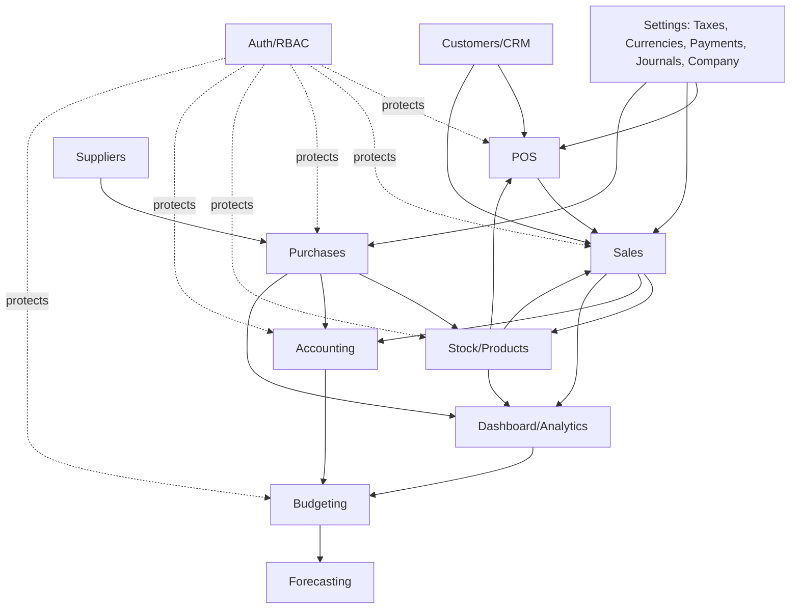

**EN — Dependency rules:** (1) business modules depend on reference modules, never the
reverse; (2) Accounting/Analytics/Budgeting are **event consumers** — never called
synchronously by sales/purchases (loose coupling); (3) Auth/RBAC is cross-cutting with no
inverse business dependency.

**FR — Règles :** (1) les modules métier dépendent des référentiels, jamais l'inverse ;
(2) Comptabilité/Analytique/Budgétisation sont **consommateurs d'événements** (couplage
faible) ; (3) Auth/RBAC transverse sans dépendance inverse.

---

## 7. TARGET ARCHITECTURE OVERVIEW / ARCHITECTURE CIBLE — VUE D'ENSEMBLE

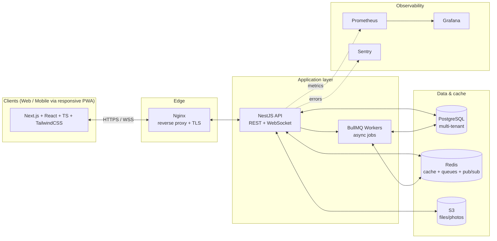

**EN — Guiding principles:** modular monolith first (NestJS modules) → migratable to
microservices later without rewrite; API-first (frontend never touches data directly);
event-driven decoupling; stateless API (JWT) for horizontal scaling; responsive PWA
(single web codebase for Android/iOS) with EN/FR i18n.

**FR — Principes directeurs :** monolithe modulaire d'abord → microservices plus tard
sans réécriture ; API-first ; orienté événements ; API stateless (JWT) scalable ;
PWA responsive (une base web pour Android/iOS) avec i18n EN/FR.

---

## 8. FRONTEND ARCHITECTURE / ARCHITECTURE FRONTEND

**Stack**: Next.js (App Router) · React · TypeScript · TailwindCSS · TanStack Query
(server state) · Zustand (local UI state) · Socket.io-client · next-intl/i18next (EN/FR).

```text
frontend/src/
├─ app/                 # Next.js routes (App Router) + layouts
│  ├─ (auth)/           # login, refresh
│  └─ (dashboard)/      # protected: pos, sales, purchases, stock, crm, budget...
├─ components/ui/       # design system (Button, Table, Modal, Card...)
├─ features/            # one folder per domain (sales, pos, crm, budget...)
│  └─ sales/ {components, hooks, api, types}
├─ lib/
│  ├─ api/              # HTTP client + JWT/refresh interceptors
│  ├─ socket/           # Socket.io connection + real-time subscriptions
│  └─ i18n/             # EN/FR dictionaries
├─ store/               # Zustand (UI, session)
└─ styles/              # Tailwind
```

- **State / État**: server via TanStack Query (cache, invalidation on WS events); UI via
  Zustand (theme, POS cart, modals). Clean separation, no duplication.
- **Route protection**: Next.js middleware + session guard; menus hidden per RBAC.
- **Mobile**: Tailwind breakpoints + PWA (manifest + service worker), installable on
  Android/iOS — meets "usable on phone via web".

---

## 9. BACKEND ARCHITECTURE / ARCHITECTURE BACKEND

**Stack**: NestJS · TypeScript · Prisma · Socket.io · BullMQ · Redis · Passport-JWT.
**Pattern**: modular monolith + Clean Architecture per module (controller → service →
repository) + DTO/validation + cross-cutting guards/interceptors.

```text
backend/src/
├─ main.ts · app.module.ts
├─ common/              # guards, interceptors, filters, decorators, pipes
│  ├─ guards/           # JwtAuthGuard, RolesGuard, TenantGuard
│  ├─ interceptors/     # logging, transform, timeout, audit
│  └─ filters/          # global exception filter
├─ config/              # env + validation
├─ prisma/              # PrismaService + schema
├─ events/              # event bus (EventEmitter + BullMQ producers)
├─ modules/
│  ├─ auth/ users/ roles/
│  ├─ tenants/ companies/ branches/
│  ├─ catalog/ inventory/
│  ├─ sales/ pos/ purchases/
│  ├─ accounting/ taxes/ journals/ payments/
│  ├─ crm/ budgeting/ forecasting/
│  ├─ analytics/ reporting/ dashboard/
│  ├─ notifications/ workflows/
│  └─ settings/ documents/
└─ workers/             # BullMQ consumers (analytics, budget, notifications)
```

**14 target services** (Phase 4): Auth, Users, CRM, Inventory, Sales, Purchases,
Accounting, Budgeting, Analytics, Reporting, Notifications, Workflows, Events, Dashboard.
**Cross-cutting**: JWT + refresh, RBAC, audit logging (interceptor), API versioning
(`/api/v1`), rate limiting (throttler + Redis), caching (Redis), uploads (S3),
transactional ops (`prisma.$transaction`).

---

## 10. DATABASE & MULTI-TENANT / BASE DE DONNÉES & MULTI-TENANT

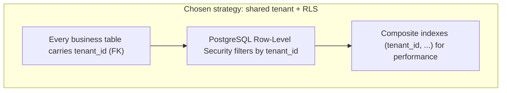

- **EN** — Model: **shared DB, shared schema, `tenant_id` + RLS** — best cost/scalability
  for a new SaaS; migratable to schema-per-tenant for a large client. Normalization 3NF,
  FKs, `CHECK`/`UNIQUE` constraints, indexes on FKs and filter columns. Audit columns +
  `audit_log` + soft-delete. Analytics via **materialized views** refreshed by workers.
  ORM: Prisma (typed schema, versioned migrations).
- **FR** — Modèle : **base partagée, schéma partagé, `tenant_id` + RLS** — meilleur
  compromis coût/scalabilité ; migrable vers schéma-par-tenant. 3NF, FK, contraintes,
  index. Audit + soft-delete. Analytique via materialized views. ORM Prisma.

> Prisma schema + SQL + full ERD → **Phase 3**.

---

## 11. API ARCHITECTURE / ARCHITECTURE API

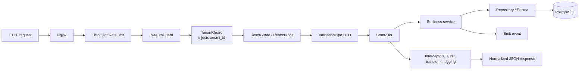

- **EN** — Versioned REST (`/api/v1`), JSON, resource conventions; WebSocket (`/realtime`)
  for push. Validated DTOs, normalized `{data, meta, error}`, standard pagination/sort/filter.
  OpenAPI/Swagger auto-generated. Every endpoint passes the guard chain.
- **FR** — REST versionné, WebSocket pour le push, DTO validés, réponses normalisées,
  pagination standard, Swagger auto-généré, chaîne de guards systématique.

---

## 12. AUTH & PERMISSIONS (RBAC) / AUTHENTIFICATION & PERMISSIONS

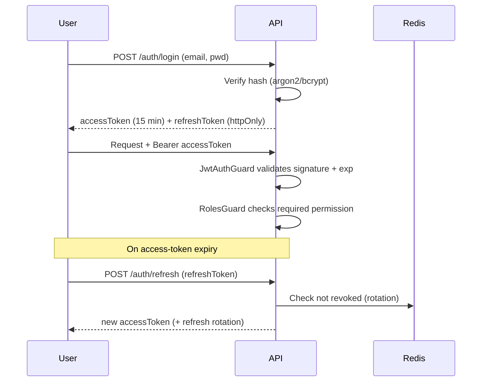

- **EN** — Short JWT access + refresh token (rotation + revocation via Redis/DB). RBAC:
  `user → roles → permissions`. The prototype's 5 roles (Admin, Manager, Cashier,
  Salesperson, Accountant) + per-user `modules[]` map to per-module/action permissions
  (`sales:create`, `budget:approve`...). `tenant_id` in JWT enforced by TenantGuard + RLS.
  argon2 hashing, httpOnly refresh cookie, strict CORS, Helmet, rate limit on `/auth`.
- **FR** — JWT court + refresh (rotation/révocation). RBAC `user → rôles → permissions`.
  Les 5 rôles du prototype + `modules[]` → permissions par module/action. `tenant_id`
  dans le JWT (TenantGuard + RLS). Bonnes pratiques sécurité.

---

## 13. EVENT-DRIVEN & REAL-TIME / ORIENTÉE ÉVÉNEMENTS & TEMPS RÉEL

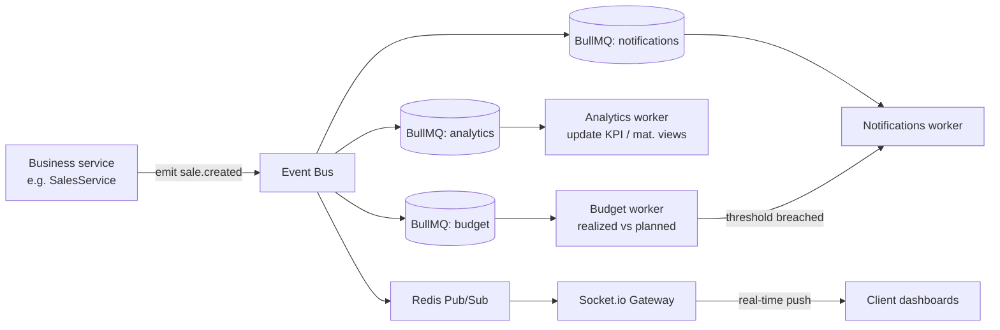

- **EN** — Key events: `sale.created`, `purchase.created`, `stock.low`,
  `payment.received`, `lead.converted`, `budget.exceeded`, `opportunity.stage_changed`.
  Async via BullMQ/Redis (fast API, heavy recompute in workers). Real-time via Socket.io +
  Redis adapter (multi-instance scalable). Idempotent jobs, retries + dead-letter queue.
- **FR** — Événements clés ci-dessus. Asynchrone via BullMQ/Redis. Temps réel via
  Socket.io + Redis adapter (scalable). Jobs idempotents, retries + dead-letter.

---

## 14. ANALYTICS, BUDGETING & CRM / ANALYTIQUE, BUDGÉTAIRE & CRM

- **Analytics/BI** — Read layer fed by events: materialized views & aggregate tables
  (`revenue_analytics`, `expense_analytics`, `kpi`, `financial_analytics`) refreshed by
  workers; forecasts (`forecast`, `cashflow_forecast`) via scheduled BullMQ cron.
- **Real-time budgeting / Budgétisation temps réel** — `budget_plan → budget_category →
  budget_allocation` by `cost_center`/`department`. Each sale/purchase: budget worker
  compares realized vs allocated and emits `budget.exceeded` → notification + dashboard.
  Approval workflow (`budget_approval`, `budget_revision`).
- **CRM** — `lead → opportunity` on a `pipeline_stage`, with `crm_activity` (meetings,
  calls, tasks, notes) and `campaign`. A won opportunity creates/links a `customer`; its
  sales feed analytics and revenue budget.

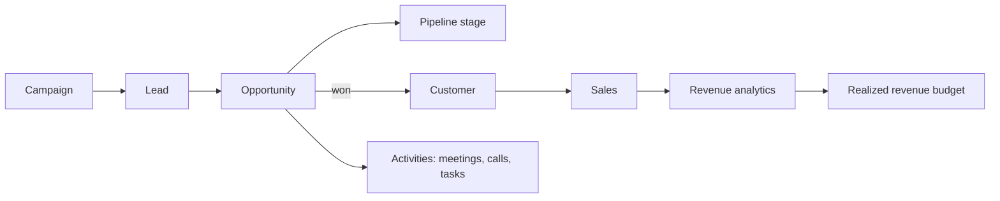

---

## 15. DEPLOYMENT & DEVOPS / DÉPLOIEMENT & DEVOPS

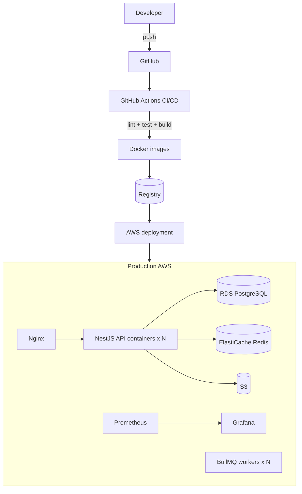

- **EN** — Docker for API/frontend/workers; Docker Compose locally (Postgres + Redis +
  Nginx + app); AWS prod (RDS, ElastiCache, S3, ECS/EKS). CI/CD via GitHub Actions
  (lint, tests, build, Prisma migrations, deploy). Monitoring: Prometheus + Grafana +
  Winston (structured logs) + Sentry. Backups: automated RDS snapshots + scheduled dumps,
  tested restore. Versioned Prisma migrations + rollback plan.
- **FR** — Docker + Docker Compose local, AWS en prod. CI/CD GitHub Actions. Monitoring
  Prometheus/Grafana/Winston/Sentry. Sauvegardes RDS + dumps planifiés, restauration
  testée. Migrations Prisma versionnées + rollback.

---

## 16. ADDITIONAL DIAGRAMS / DIAGRAMMES COMPLÉMENTAIRES

### 16.1 Request lifecycle / Cycle de vie d'une requête
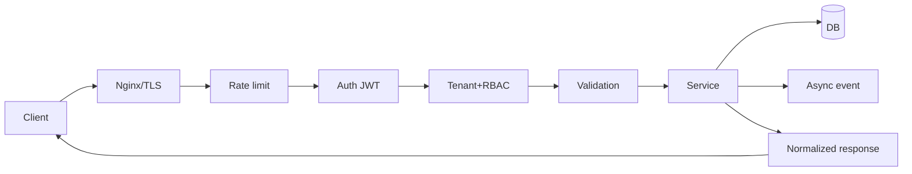

### 16.2 Real-time communication / Communication temps réel
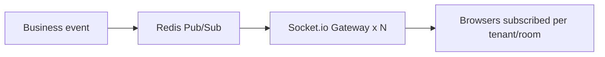

### 16.3 Analytics data flow / Flux de données analytique
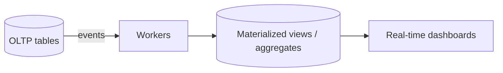

---

## 17. ARCHITECTURE DECISIONS / DÉCISIONS D'ARCHITECTURE

| # | Decision / Décision | Rationale / Justification | Rejected / Écartée |
|---|---|---|---|
| 1 | Modular monolith NestJS | Clean domain boundaries, simple deploy, evolvable | Microservices upfront (premature complexity) |
| 2 | PostgreSQL + Prisma | Strong relational (acct/finance), typed migrations | MongoDB (weak transactional consistency) |
| 3 | Multi-tenant `tenant_id` + RLS | Optimal cost/scalability for new SaaS | DB-per-tenant (costly) |
| 4 | Event-driven (BullMQ/Redis) | Decouples analytics/budget/notif, fast API | Synchronous compute (latency, coupling) |
| 5 | JWT + refresh + RBAC | Stateless, horizontally scalable | Server sessions (state, scaling) |
| 6 | Socket.io + Redis adapter | Multi-instance real-time | Polling (load, latency) |
| 7 | Next.js responsive PWA | One web codebase for Android/iOS, EN/FR | Separate native apps (cost) |
| 8 | S3 for files | Offloads DB (vs prototype base64) | DB blob storage (saturation) |

### Data migration strategy / Stratégie de migration des données
1. **EN** — Export `localStorage` keys (`ca_*`) to JSON.
2. Transform: resolve denormalized labels (`sale.client` name → `customer_id`, payment
   name → `payment_method_id`, journal code → `journal_id`).
3. Rebuild **sale lines** from the `articles` text field (best-effort; else single line +
   flag).
4. Upload base64 photos to S3, replace with URLs.
5. Idempotent insert under a bootstrap `tenant_id`/`company_id`, in a transaction, with a
   reconciliation report.

### Avoiding tech debt / future modules — Éviter la dette / futurs modules
- **EN** — Each new module = isolated NestJS folder + frontend feature + its `tenant_id`
  tables → no impact on existing code. Inter-module communication **only** via events or
  service interfaces. Mandatory tests + CI, enforced naming and lint from Phase 2.
- **FR** — Chaque nouveau module = dossier NestJS isolé + feature frontend + tables
  `tenant_id`. Communication inter-modules uniquement par événements/interfaces. Tests +
  CI obligatoires, conventions et lint dès la Phase 2.

---

## ✅ END OF PHASE 1 / FIN DE LA PHASE 1

**EN** — Delivered: prototype analysis, inventory of modules/entities/relationships,
workflows, dependencies, and the full target architecture with diagrams. **No project has
been initialized and no application code generated** — per your instruction ("start with
Phase 1 only, do not continue automatically").

**FR** — Livré : analyse du prototype, inventaire des modules/entités/relations,
workflows, dépendances, et la conception complète de l'architecture cible avec diagrammes.
**Aucun projet initialisé, aucun code généré** — conformément à votre consigne.

➡️ **Awaiting your confirmation / En attente de votre confirmation** to start
**Phase 2 — Project Initialization / Initialisation du projet** (frontend/backend
scaffolding, database, Docker, Git, environments, CI/CD, with commands and config files).
