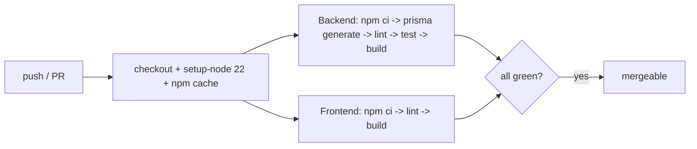

# PHASE 2 — PROJECT INITIALIZATION / INITIALISATION DU PROJET

> **EN** — This phase scaffolds the runnable monorepo foundation: frontend (Next.js),
> backend (NestJS), database (PostgreSQL), cache/queues (Redis), Docker environment, Git
> repository, environment configuration, and CI/CD. Every dependency is explained (role,
> why, professional alternatives). **No business modules yet** — those are Phases 4–6.
>
> **FR** — Cette phase pose les fondations exécutables du monorepo : frontend (Next.js),
> backend (NestJS), base de données (PostgreSQL), cache/files (Redis), environnement
> Docker, dépôt Git, configuration d'environnement et CI/CD. Chaque dépendance est
> expliquée (rôle, pourquoi, alternatives). **Aucun module métier** — Phases 4 à 6.

---

## 0. WHAT WAS CREATED / CE QUI A ÉTÉ CRÉÉ

```text
ERP-PROJECT/
├─ package.json              # npm workspaces root (backend + frontend)
├─ .env.example              # root env (docker-compose) — copy to .env
├─ .gitignore .editorconfig .nvmrc
├─ docker-compose.yml        # postgres · redis · backend · frontend · nginx
├─ README.md
├─ nginx/nginx.conf          # reverse proxy (API + WS + web)
├─ .github/workflows/ci.yml  # GitHub Actions CI (lint · test · build)
├─ backend/                  # NestJS API
│  ├─ package.json tsconfig*.json nest-cli.json .eslintrc.cjs .prettierrc
│  ├─ .env.example .dockerignore Dockerfile
│  ├─ prisma/schema.prisma   # init placeholder (full model = Phase 3)
│  └─ src/
│     ├─ main.ts             # bootstrap: helmet, CORS, /api/v1, Swagger, validation
│     ├─ app.module.ts       # root module (config, throttler, prisma)
│     ├─ config/env.validation.ts
│     ├─ prisma/{prisma.module.ts, prisma.service.ts}
│     └─ health/health.controller.ts   # GET /api/v1/health
└─ frontend/                 # Next.js web app
   ├─ package.json tsconfig.json next.config.mjs tailwind.config.ts
   ├─ postcss.config.mjs .eslintrc.json .env.example .dockerignore Dockerfile
   └─ src/
      ├─ app/{layout.tsx, page.tsx, globals.css}
      └─ lib/providers.tsx   # TanStack Query provider
```

**EN** — Why a **monorepo with npm workspaces**? One repo, one install, shared tooling,
atomic cross-stack commits, simpler CI. Alternatives: separate repos (more overhead),
Nx/Turborepo (powerful caching but extra complexity — can be added later without moving files).

**FR** — Pourquoi un **monorepo avec npm workspaces** ? Un seul dépôt, une installation,
outillage partagé, commits cross-stack atomiques, CI simplifiée. Alternatives : dépôts
séparés (plus lourd), Nx/Turborepo (cache puissant mais complexité ajoutée — possible plus tard).

---

## 1. PREREQUISITES / PRÉREQUIS

Verified on this machine / Vérifié sur cette machine :

| Tool | Required | Present |
|---|---|---|
| Node.js | ≥ 20 (LTS) | **v22** ✓ |
| npm | ≥ 9 | **9** ✓ |
| Docker | ≥ 24 | **29** ✓ |
| Docker Compose | v2+ | **v5** ✓ |
| Git | ≥ 2.30 | **2.53** ✓ |

> **EN** — `.nvmrc` pins Node 22: run `nvm use` to match.
> **FR** — `.nvmrc` fixe Node 22 : `nvm use` pour s'aligner.

---

## 2. STEP-BY-STEP SETUP / INSTALLATION ÉTAPE PAR ÉTAPE

### Step 1 — Environment file / Fichier d'environnement
```bash
cp .env.example .env
# Generate strong secrets / Générer des secrets robustes :
openssl rand -base64 48   # -> JWT_ACCESS_SECRET
openssl rand -base64 48   # -> JWT_REFRESH_SECRET
# Edit .env: set POSTGRES_PASSWORD, the two JWT secrets, and DATABASE_URL password.
```
**EN** — `.env` is git-ignored; only `.env.example` is committed. Never commit real secrets.
**FR** — `.env` est ignoré par git ; seul `.env.example` est versionné. Ne jamais committer de secrets.

### Step 2 — Option A: run everything with Docker (recommended) / Tout lancer avec Docker
```bash
docker compose up -d --build      # builds & starts the 5 services
docker compose ps                 # check health
docker compose logs -f backend    # follow logs
```
Then / Ensuite :
```bash
# Initialize the database schema (creates the placeholder table):
docker compose exec backend npm run prisma:migrate -- --name init
```
- Web (via Nginx): http://localhost:8080
- Web (direct): http://localhost:3000
- API: http://localhost:4000/api/v1/health → `{ "status": "ok", "database": "up" }`
- Swagger: http://localhost:4000/api/docs

### Step 2 — Option B: run on the host / Lancer sur la machine hôte
```bash
# 1) Start only data services with Docker:
docker compose up -d postgres redis

# 2) Install all workspaces from the root:
npm install

# 3) Backend:
cp backend/.env.example backend/.env   # set DATABASE_URL host = localhost
npm run prisma:generate -w backend
npm run prisma:migrate -w backend -- --name init
npm run dev -w backend                 # http://localhost:4000

# 4) Frontend (new terminal):
cp frontend/.env.example frontend/.env.local
npm run dev -w frontend                # http://localhost:3000
```

### Step 3 — Git / Dépôt Git
```bash
# Already initialized on branch "main" (no commit made yet).
git status
git commit -m "chore: phase 2 — project scaffold"   # when you're ready
git checkout -b develop                              # long-lived dev branch
# git remote add origin <your-repo-url> && git push -u origin main
```
**EN** — Branch model: `main` (production), `develop` (integration), `feature/*` per task.
CI runs on push/PR to `main` and `develop`.
**FR** — Modèle de branches : `main` (prod), `develop` (intégration), `feature/*` par tâche.
La CI se déclenche sur push/PR vers `main` et `develop`.

---

## 3. DEPENDENCY RATIONALE / RÔLE DES DÉPENDANCES

### 3.1 Backend (NestJS)

| Package | Role / Rôle | Why / Pourquoi | Alternatives |
|---|---|---|---|
| `@nestjs/core`,`common`,`platform-express` | Framework + HTTP (Express) | Modular DI architecture matching our domain split | Fastify adapter; raw Express; Fastify+tRPC |
| `@nestjs/config` | Typed env config | Centralized, validated configuration | dotenv only (no validation) |
| `@nestjs/jwt`,`passport`,`passport-jwt` | JWT auth | Stateless auth + refresh + RBAC (Phase 12 design) | Auth0/Clerk (managed), Lucia |
| `@nestjs/throttler` | Rate limiting | Abuse/DoS protection on `/auth` and APIs | nginx limit_req; express-rate-limit |
| `@nestjs/swagger` | OpenAPI docs | Auto contract & client generation | tRPC, manual OpenAPI |
| `@nestjs/websockets`,`platform-socket.io` | Real-time gateway | Live dashboards, notifications (Phase 13) | ws, SSE, Pusher/Ably |
| `@prisma/client` + `prisma` | ORM + migrations | Typed schema, safe migrations, great DX | TypeORM, Drizzle, Kysely |
| `class-validator`,`class-transformer` | DTO validation | Reject/clean every request payload | zod (+ nestjs-zod) |
| `helmet` | Security headers | Hardening out of the box | manual headers |
| `reflect-metadata`,`rxjs` | Decorators / reactive core | Required by NestJS | — |

### 3.2 Frontend (Next.js)

| Package | Role / Rôle | Why / Pourquoi | Alternatives |
|---|---|---|---|
| `next`,`react`,`react-dom` | SSR/SSG React framework | Routing, SSR, PWA, performance | Vite SPA, Remix |
| `typescript`,`@types/*` | Static typing | Safety across a large codebase | plain JS (rejected) |
| `tailwindcss`,`postcss`,`autoprefixer` | Utility-first CSS | Fast, consistent, responsive design system | CSS Modules, MUI, Chakra |
| `@tanstack/react-query` | Server-state cache | Caching, refetch, WS-driven invalidation | SWR, RTK Query |
| `zustand` | Local UI state | Lightweight (POS cart, theme, modals) | Redux Toolkit, Jotai |
| `socket.io-client` | Real-time client | Matches backend Socket.io | native WebSocket, SSE |
| `axios` | HTTP client | Interceptors for JWT/refresh | fetch wrapper, ky |
| `next-intl` | i18n EN/FR | Required bilingual support | react-i18next |

### 3.3 Infrastructure

| Service | Role / Rôle | Why / Pourquoi | Alternatives |
|---|---|---|---|
| PostgreSQL 16 | Relational source of truth | ACID, strong relations for accounting/finance | MySQL, CockroachDB |
| Redis 7 | Cache · BullMQ queues · Socket.io pub/sub | Fast, multi-purpose, scales WS | Memcached (cache only), RabbitMQ (queues) |
| Nginx | Reverse proxy / TLS | Single entry point, WS upgrade, TLS termination | Traefik, Caddy |
| Docker / Compose | Reproducible environments | "Works on every machine", parity dev↔prod | Podman; local installs (rejected) |
| GitHub Actions | CI/CD | Native to GitHub, free tier, simple YAML | GitLab CI, CircleCI, Jenkins |

---

## 4. ENVIRONMENT VARIABLES / VARIABLES D'ENVIRONNEMENT

| Variable | Scope | Description |
|---|---|---|
| `POSTGRES_USER/PASSWORD/DB` | compose | DB credentials & name |
| `DATABASE_URL` | backend | Prisma connection string (host=`postgres` in Docker, `localhost` on host) |
| `REDIS_URL` | backend | Redis connection (cache/queues/pubsub) |
| `JWT_ACCESS_SECRET` / `JWT_REFRESH_SECRET` | backend | Token signing secrets (random, never committed) |
| `JWT_ACCESS_TTL` / `JWT_REFRESH_TTL` | backend | Token lifetimes (seconds) |
| `CORS_ORIGIN` | backend | Allowed web origins |
| `NODE_ENV` | all | `development` \| `production` \| `test` |
| `NEXT_PUBLIC_API_URL` / `NEXT_PUBLIC_WS_URL` | frontend | Public endpoints (browser-exposed) |
| `*_PORT` | compose | Host port mappings |

> **EN** — Only `NEXT_PUBLIC_*` vars reach the browser. Env is validated at backend boot
> (`env.validation.ts`) — the app refuses to start if misconfigured (fail fast).
> **FR** — Seules les variables `NEXT_PUBLIC_*` atteignent le navigateur. L'env est validé
> au démarrage du backend — l'app refuse de démarrer si mal configurée (fail fast).

---

## 5. CI/CD PIPELINE / PIPELINE CI/CD

`.github/workflows/ci.yml` runs on push/PR to `main`/`develop`:



- **EN** — Backend job spins up ephemeral Postgres + Redis services so tests run against
  real infra. Future steps (Phase 15): build & push Docker images, deploy to AWS, run
  `prisma migrate deploy`.
- **FR** — Le job backend démarre des services Postgres + Redis éphémères pour des tests
  réalistes. Étapes futures (Phase 15) : build/push images Docker, déploiement AWS,
  `prisma migrate deploy`.

---

## 6. HOW MODULES WILL PLUG IN / COMMENT LES MODULES S'INSÉRERONT

**EN** — Each future feature (auth, sales, crm, budgeting…) is a NestJS module under
`backend/src/modules/<name>/` registered in `app.module.ts`, plus a frontend feature under
`frontend/src/features/<name>/`. The Prisma schema grows by adding models (Phase 3). No
existing file is rewritten — only extended. This keeps modularity and avoids tech debt.

**FR** — Chaque future fonctionnalité est un module NestJS sous
`backend/src/modules/<nom>/` enregistré dans `app.module.ts`, plus une feature frontend
sous `frontend/src/features/<nom>/`. Le schéma Prisma grandit par ajout de modèles
(Phase 3). Aucun fichier existant n'est réécrit — seulement étendu. Modularité préservée,
pas de dette technique.

---

## 7. VERIFICATION CHECKLIST / VÉRIFICATION

```bash
docker compose up -d --build
curl -s http://localhost:4000/api/v1/health     # {"status":"ok","database":"up",...}
open http://localhost:3000                       # shows "Phase 2 — project initialized ✓, API: up"
open http://localhost:4000/api/docs              # Swagger UI
docker compose down                              # stop
```

> **EN — Note:** dependencies are not installed yet. Run `npm install` (host) or
> `docker compose up --build` to fetch them, then run the checklist above.
> **FR — Note :** les dépendances ne sont pas encore installées. Lancez `npm install`
> (hôte) ou `docker compose up --build`, puis exécutez la liste ci-dessus.

---

## ✅ END OF PHASE 2 / FIN DE LA PHASE 2

**EN** — Delivered: monorepo scaffold, frontend & backend bootstrap (both start and talk
to each other via `/health`), PostgreSQL + Redis + Nginx via Docker Compose, Git repo
initialized, validated env configuration, and a working CI pipeline. Foundation is
runnable and ready for the data model.

**FR** — Livré : scaffold monorepo, bootstrap frontend & backend (qui démarrent et
communiquent via `/health`), PostgreSQL + Redis + Nginx via Docker Compose, dépôt Git
initialisé, configuration d'environnement validée et pipeline CI fonctionnel. Fondation
exécutable, prête pour le modèle de données.

➡️ **Awaiting your confirmation / En attente de votre confirmation** to start
**Phase 3 — Database Design / Conception de la base de données** (full normalized Prisma
schema for the 50 ERP/CRM/Budgeting/Analytics tables, relations, constraints, indexes,
migrations, audit, and the ERD).
