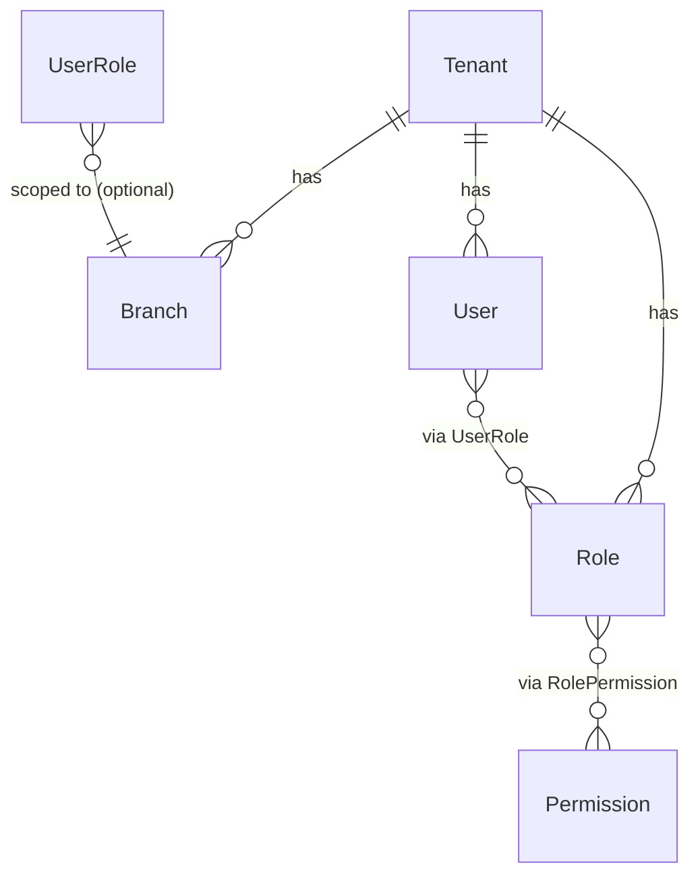
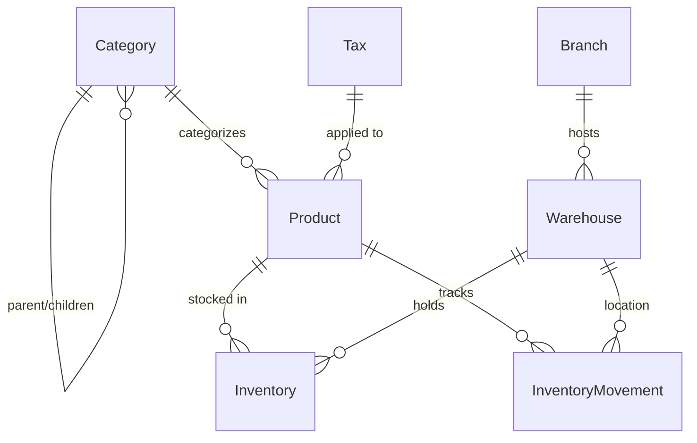
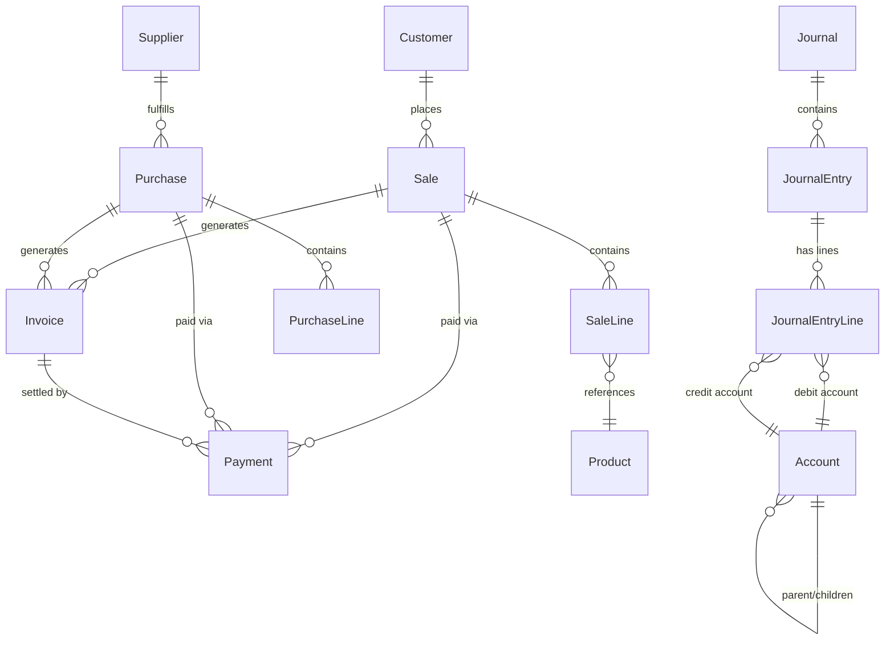
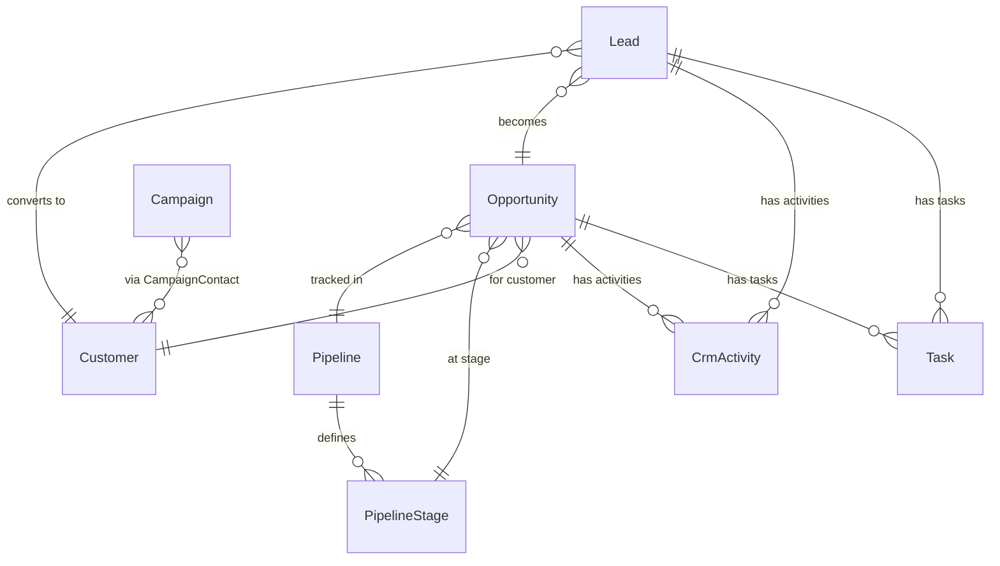
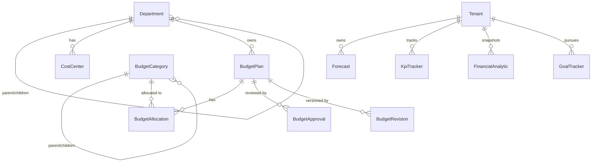
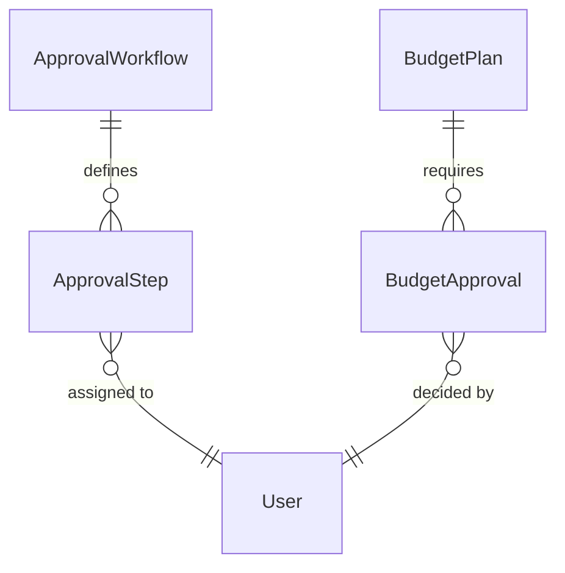

# PHASE 3 — DATABASE DESIGN / CONCEPTION DE LA BASE DE DONNÉES

> **EN** — This phase delivers the complete, production-grade PostgreSQL schema for the entire
> platform: 57 tables across 8 domains (Auth, Catalog, Inventory, Sales, Finance, CRM,
> Budgeting, Analytics). Every design decision is explained. The Prisma schema is the single
> source of truth — migrations and the TypeScript client are generated from it.
>
> **FR** — Cette phase livre le schéma PostgreSQL complet et prêt pour la production : 57 tables
> réparties dans 8 domaines (Auth, Catalogue, Inventaire, Ventes, Finance, CRM, Budgétisation,
> Analytique). Chaque décision de conception est expliquée. Le schéma Prisma est la source
> de vérité unique — migrations et client TypeScript en sont générés.

---

## 0. WHAT WAS CREATED / CE QUI A ÉTÉ CRÉÉ

**File modified / Fichier modifié :** `backend/prisma/schema.prisma`

### Table inventory / Inventaire des tables

| # | Model / Modèle | Domain / Domaine | Purpose / Rôle |
|---|---|---|---|
| 1 | `Tenant` | Auth | Root multi-tenant entity |
| 2 | `Branch` | Auth | Company branch/location |
| 3 | `User` | Auth | Platform user |
| 4 | `Role` | Auth | Tenant-scoped RBAC role |
| 5 | `Permission` | Auth | Global permission definition |
| 6 | `RolePermission` | Auth | Role ↔ Permission join |
| 7 | `UserRole` | Auth | User ↔ Role assignment (per branch) |
| 8 | `Category` | Catalog | Hierarchical product category |
| 9 | `Product` | Catalog | Product or service |
| 10 | `Supplier` | Catalog | Supplier/vendor |
| 11 | `Customer` | Catalog | Customer/client |
| 12 | `Warehouse` | Inventory | Stock location |
| 13 | `Inventory` | Inventory | Stock level per product/warehouse |
| 14 | `InventoryMovement` | Inventory | Immutable stock movement log |
| 15 | `Sale` | Sales | Sale order header |
| 16 | `SaleLine` | Sales | Sale order line item |
| 17 | `Purchase` | Sales | Purchase order header |
| 18 | `PurchaseLine` | Sales | Purchase order line item |
| 19 | `Tax` | Finance | Tax rate/rule |
| 20 | `Invoice` | Finance | Invoice (sale or purchase) |
| 21 | `Payment` | Finance | Payment record |
| 22 | `Account` | Finance | Chart of accounts (hierarchical) |
| 23 | `Journal` | Finance | Accounting journal |
| 24 | `JournalEntry` | Finance | Double-entry bookkeeping entry |
| 25 | `JournalEntryLine` | Finance | Debit/credit line |
| 26 | `AuditLog` | System | Immutable audit trail |
| 27 | `ActivityLog` | System | User activity log |
| 28 | `Notification` | System | In-app notification |
| 29 | `Setting` | System | Tenant key-value settings |
| 30 | `EventLog` | System | Real-time event stream log |
| 31 | `Lead` | CRM | Sales lead |
| 32 | `Pipeline` | CRM | Sales pipeline definition |
| 33 | `PipelineStage` | CRM | Stage within a pipeline |
| 34 | `Opportunity` | CRM | Sales opportunity |
| 35 | `CrmActivity` | CRM | CRM activity (email, call, etc.) |
| 36 | `Meeting` | CRM | Scheduled meeting |
| 37 | `Call` | CRM | Call record |
| 38 | `Task` | CRM | Task (assignable, linked to CRM) |
| 39 | `Note` | CRM | Free-text note |
| 40 | `Campaign` | CRM | Marketing campaign |
| 41 | `CampaignContact` | CRM | Campaign ↔ Customer join |
| 42 | `Department` | Org | Organizational department |
| 43 | `CostCenter` | Org | Cost center (linked to department) |
| 44 | `BudgetPlan` | Budgeting | Annual/periodic budget plan |
| 45 | `BudgetCategory` | Budgeting | Budget line category |
| 46 | `BudgetAllocation` | Budgeting | Category allocation per period |
| 47 | `BudgetApproval` | Budgeting | Budget approval record |
| 48 | `BudgetRevision` | Budgeting | Immutable budget revision snapshot |
| 49 | `Forecast` | Analytics | Revenue/expense/cashflow forecast |
| 50 | `KpiTracker` | Analytics | KPI measurement per period |
| 51 | `FinancialAnalytic` | Analytics | Pre-computed financial snapshot |
| 52 | `RevenueAnalytic` | Analytics | Pre-computed revenue snapshot |
| 53 | `ExpenseAnalytic` | Analytics | Pre-computed expense snapshot |
| 54 | `CashFlowForecast` | Analytics | Cash flow projection |
| 55 | `GoalTracker` | Analytics | Goal tracking |
| 56 | `ApprovalWorkflow` | Workflow | Approval workflow template |
| 57 | `ApprovalStep` | Workflow | Individual approval step/instance |

---

## 1. DESIGN PRINCIPLES / PRINCIPES DE CONCEPTION

### 1.1 Multi-Tenancy (Row-Level Isolation)

**EN** — Every business table carries a `tenantId` column. All Prisma queries in the
application layer MUST include `where: { tenantId }` — this is enforced by a shared
base repository pattern (Phase 4). No cross-tenant data can leak as long as every
query is tenant-scoped. This is the **shared-schema, row-level isolation** SaaS model —
it is the industry standard for mid-market SaaS (Shopify, HubSpot all use it) because
it maximizes database reuse and simplifies migrations while keeping costs manageable.

**FR** — Chaque table métier porte une colonne `tenantId`. Toutes les requêtes Prisma
de la couche applicative DOIVENT inclure `where: { tenantId }` — imposé par un
repository de base partagé (Phase 4). Le modèle choisi est **shared-schema, isolation
par ligne** — standard SaaS pour les marchés mid-market car il maximise la réutilisation
de la base et simplifie les migrations tout en maîtrisant les coûts.

```
Tenant A ──► tenantId = "uuid-A"  ──► tous ses enregistrements
Tenant B ──► tenantId = "uuid-B"  ──► tous ses enregistrements
           (même tables, lignes isolées par tenantId)
```

### 1.2 UUID Primary Keys

**EN** — All PKs are `String @id @default(uuid())`. Reasons: (1) no central counter
bottleneck under write concurrency; (2) safe for distributed inserts (multiple app
instances); (3) IDs can be generated client-side before the INSERT; (4) no sequential
enumeration attack on REST endpoints. Trade-off: UUIDs are larger than integers and
fragment B-tree indexes slightly — compensated by composite indexes on `(tenantId, ...)`.

**FR** — Toutes les PK sont des UUID. Raisons : (1) pas de goulot d'étranglement sur un
compteur central ; (2) sûr pour les insertions distribuées ; (3) génération côté client
possible avant INSERT ; (4) pas d'énumération séquentielle sur les endpoints REST. Compromis :
taille supérieure à un entier, fragmentation légère des B-trees — compensée par les index
composites sur `(tenantId, ...)`.

### 1.3 Decimal for Monetary Values

**EN** — All money columns use `Decimal @db.Decimal(15, 2)` (15 digits, 2 decimal places).
This maps to PostgreSQL `NUMERIC(15,2)` — exact arithmetic with no floating-point rounding
errors. Prices use `Decimal(15,4)` (4 decimals for unit prices to avoid truncation when
multiplied). Margins and rates use `Decimal(8,4)` or `Decimal(5,2)`. Never use `Float`
for money.

**FR** — Toutes les colonnes monétaires utilisent `Decimal @db.Decimal(15,2)`, soit
`NUMERIC(15,2)` PostgreSQL — arithmétique exacte sans arrondi flottant. Les prix utilisent
`Decimal(15,4)`. Ne jamais utiliser `Float` pour de l'argent.

### 1.4 Soft Deletes

**EN** — Business entities that users might need to recover or reference in historical
records carry a `deletedAt DateTime?` column. A `null` value means active; a timestamp
means soft-deleted. This pattern preserves referential integrity (a sale line can still
reference its product even after the product is "deleted") and supports audit requirements.
Application code filters `where: { deletedAt: null }` by default.

**FR** — Les entités métier récupérables ou référencées dans l'historique portent
`deletedAt DateTime?`. La valeur `null` = actif, un timestamp = supprimé logiquement.
Ce pattern préserve l'intégrité référentielle et répond aux exigences d'audit.
Le code filtre `where: { deletedAt: null }` par défaut.

### 1.5 Immutable Logs

**EN** — `AuditLog`, `InventoryMovement`, `EventLog`, `BudgetRevision`, and `ActivityLog`
have no `updatedAt` and no `deletedAt`. They are append-only. No application code should
ever `UPDATE` or `DELETE` rows from these tables. Future Phase adds PostgreSQL row-level
security policies and a dedicated read-only DB user for these tables.

**FR** — `AuditLog`, `InventoryMovement`, `EventLog`, `BudgetRevision`, `ActivityLog`
sont des logs immuables en ajout seul. Aucun code applicatif ne doit mettre à jour ou
supprimer ces lignes.

### 1.6 Normalization Level

**EN** — The schema is in **3NF (Third Normal Form)** with selective denormalization.
Denormalized fields kept intentionally:
- `Sale.subtotal / taxAmount / total` — pre-computed for query performance (recalculated on save)
- `JournalEntry.totalDebit / totalCredit` — fast balance check without aggregating lines
- `Inventory.tenantId` — allows single-table scan for all tenant stock without joining Warehouse
- Analytics tables (`FinancialAnalytic`, `RevenueAnalytic`, etc.) — materialized aggregates, not normalized

**FR** — Schéma en **3NF** avec dénormalisation sélective pour la performance. Les champs
dénormalisés sont recalculés à chaque sauvegarde et ne sont jamais la source de vérité.

---

## 2. DOMAIN ARCHITECTURE / ARCHITECTURE PAR DOMAINE

### 2.1 Auth & Multi-Tenant Domain

```
Tenant (1) ──── (N) Branch
Tenant (1) ──── (N) User
Tenant (1) ──── (N) Role ──── (N) Permission  [via RolePermission]
User   (N) ──── (N) Role                       [via UserRole, optional branch scope]
```

**EN — Why separate Role from Permission?**
Roles are tenant-specific (a "Manager" role at Tenant A may differ from Tenant B).
Permissions are global constants defined at deployment (`sales:create`, `inventory:read`, etc.).
This RBAC model (Role-Based Access Control) separates **what exists** (permissions) from
**who has it** (roles → users). New permissions are added by code deploys; roles are
configured by tenant admins without code changes.

**FR — Pourquoi séparer Role de Permission ?**
Les rôles sont spécifiques au tenant. Les permissions sont des constantes globales définies
au déploiement. Ce modèle RBAC sépare **ce qui existe** (permissions) de **qui l'a** (rôles →
utilisateurs). Nouvelles permissions = déploiement ; nouveaux rôles = configuration tenant.

### 2.2 Catalog Domain

```
Category (tree, self-referencing) ──── (N) Product
Supplier ──────────────────────────── (N) Purchase
Customer ──────────────────────────── (N) Sale
Product  ──────────────────────────── (N) Tax (optional)
```

**EN** — `Category` is a recursive tree (`parentId → self`). A product can have no category
(uncategorized), one category, or belong to a leaf node of a multi-level hierarchy.
`Product.isService = true` marks intangible services that don't affect inventory.

**FR** — `Category` est un arbre récursif. `Product.isService = true` désigne les services
immatériels qui n'impactent pas le stock.

### 2.3 Inventory Domain

```
Product (N) ──── (N) Warehouse  [via Inventory — current stock level]
Product (1) ──── (N) InventoryMovement  [immutable log of every stock change]
Warehouse   ──── Branch (optional)
```

**EN — Why separate Inventory from InventoryMovement?**
`Inventory` is the **current state** (one row per product/warehouse, updated in place).
`InventoryMovement` is the **audit trail** (append-only, one row per event). This pattern —
called the "ledger" pattern — lets you reconstruct stock at any historical point by replaying
movements, while `Inventory` gives you O(1) reads of current stock. Never recalculate stock
by summing movements at query time for high-traffic tables.

**FR — Pourquoi séparer Inventory d'InventoryMovement ?**
`Inventory` = état courant (mis à jour en place). `InventoryMovement` = journal immuable.
Ce pattern "ledger" permet de reconstituer le stock à toute date historique tout en offrant
des lectures O(1) du stock courant.

### 2.4 Sales & Purchase Domain

```
Sale (1) ──── (N) SaleLine ──── Product
Sale (1) ──── (N) Invoice
Sale (1) ──── (N) Payment
Purchase (1) ──── (N) PurchaseLine ──── Product
Purchase (1) ──── (N) Invoice
Purchase (1) ──── (N) Payment
```

**EN** — A `Sale` can produce multiple `Invoice` records (partial billing, credit notes).
A `Payment` can be linked to a Sale directly (POS), to a Purchase, or to an Invoice.
`SaleLine.discount` is a percentage applied to that line. The Sale header stores pre-computed
`subtotal`, `taxAmount`, `discountAmount`, and `total` to avoid recalculating on every read.

**FR** — Une `Sale` peut produire plusieurs `Invoice` (facturation partielle, avoirs).
Un `Payment` peut être lié à une Sale (POS), à un Purchase, ou à une Invoice.
Les totaux de la Sale sont précalculés pour éviter les agrégats répétés.

### 2.5 Finance Domain

```
Account (tree) ──── JournalEntryLine (debit or credit)
Journal (1) ──── (N) JournalEntry (1) ──── (N) JournalEntryLine
```

**EN — Double-entry bookkeeping**
Every financial transaction is recorded as a `JournalEntry` with two or more
`JournalEntryLine` rows where `SUM(debit) == SUM(credit)`. This is the foundation of
all accounting (GAAP/IFRS). `Account` follows a standard chart of accounts hierarchy
(Assets → Liabilities → Equity → Revenue → Expenses). The `totalDebit / totalCredit`
on `JournalEntry` are denormalized for fast balance validation.

**FR — Comptabilité en partie double**
Chaque transaction financière est enregistrée comme `JournalEntry` avec des lignes de débit
et crédit équilibrées (`SUM(débit) == SUM(crédit)`). `Account` suit un plan comptable
hiérarchique standard. `totalDebit / totalCredit` sur `JournalEntry` sont dénormalisés
pour validation rapide de l'équilibre.

### 2.6 CRM Domain

```
Lead ──────────► Opportunity ──────────► Customer  (conversion lifecycle)
Lead (N) ──── (N) CrmActivity
Lead (N) ──── (N) Task
Opportunity ── PipelineStage ── Pipeline
Customer ────── Campaign [via CampaignContact]
Meeting / Call / Note ──── Customer | Lead | Opportunity
```

**EN — Lead lifecycle**
`Lead` → qualified → `Opportunity` → won → `Customer`. The `Lead.opportunityId` stores the
linked opportunity when a lead converts. `Lead.convertedAt` timestamps the conversion.
The pipeline model (Pipeline → PipelineStage → Opportunity) allows each tenant to define
custom stages (e.g., "Demo Booked" instead of generic "Proposal").

**FR — Cycle de vie du lead**
`Lead` → qualifié → `Opportunity` → gagné → `Customer`. Chaque tenant peut définir ses
propres étapes de pipeline via `PipelineStage`.

### 2.7 Budgeting Domain

```
BudgetPlan ──── Department (optional)
BudgetPlan (1) ──── (N) BudgetAllocation ──── BudgetCategory
BudgetPlan (1) ──── (N) BudgetApproval ──── User (approver)
BudgetPlan (1) ──── (N) BudgetRevision  (immutable snapshots)
BudgetCategory (tree, self-referencing)
```

**EN** — A `BudgetPlan` covers a fiscal year for an optional department. `BudgetAllocation`
rows hold (allocated, actual, variance) per (category, period) — `period` is a string like
`"2026-Q1"` or `"2026-03"` giving flexibility for monthly/quarterly/annual splits.
`BudgetRevision` stores a full JSON snapshot of the plan on every approved change — this
is the immutable audit trail for financial compliance.

**FR** — `BudgetAllocation` stocke (alloué, réel, variance) par (catégorie, période).
`BudgetRevision` stocke un snapshot JSON complet du plan à chaque modification approuvée —
trace immuable pour la conformité financière.

### 2.8 Analytics Domain

**EN** — Analytics tables (`FinancialAnalytic`, `RevenueAnalytic`, `ExpenseAnalytic`,
`CashFlowForecast`) are **pre-computed aggregates** populated by a background BullMQ job
(Phase 4) that runs on a schedule (nightly, hourly for KPIs). They are never the source
of truth — they are materialized views in application code. This pattern keeps dashboards
fast (single-row reads) without expensive real-time aggregations across millions of rows.
`Forecast` stores projections generated by the forecasting engine. `KpiTracker` stores
one row per KPI per period — updated by the same background jobs.

**FR** — Les tables analytiques sont des agrégats précalculés peuplés par des jobs BullMQ
en arrière-plan. Ce pattern maintient les dashboards rapides (lectures d'une seule ligne)
sans agrégations coûteuses en temps réel.

---

## 3. INDEX STRATEGY / STRATÉGIE D'INDEX

**EN** — All indexes follow the same rule: prefix every query-time predicate with `tenantId`
because every query in a multi-tenant system starts by narrowing to one tenant.

**FR** — Tous les index commencent par `tenantId` car chaque requête multi-tenant réduit
d'abord au périmètre d'un seul tenant.

| Pattern | Index | Reason |
|---|---|---|
| Every business table | `@@index([tenantId])` | Tenant isolation baseline |
| Sales list by date | `@@index([tenantId, saleDate])` | Dashboard date-range queries |
| Sales by customer | `@@index([tenantId, customerId])` | Customer history queries |
| Sales by status | `@@index([tenantId, status])` | Pipeline/status filters |
| Audit trail | `@@index([tenantId, entity, entityId])` | Entity change history |
| Audit by user | `@@index([tenantId, userId])` | User activity reports |
| Audit by date | `@@index([tenantId, createdAt])` | Time-range audit queries |
| Inventory | `@@unique([productId, warehouseId])` | Stock lookup, prevents duplicates |
| Movements | `@@index([tenantId, productId])` | Product movement history |
| Notifications | `@@index([tenantId, userId, isRead])` | Unread badge count query |
| KPI | `@@index([tenantId, period])` | Period filter on KPIs |
| Analytics | `@@index([tenantId, periodDate])` | Date-range analytics queries |
| Leads | `@@index([tenantId, status])` | Lead pipeline views |
| Opportunities | `@@index([tenantId, status])` + `[tenantId, customerId]` | Pipeline + CRM 360 |

**EN — Unique constraints as implicit indexes**
All `@@unique` create both a uniqueness constraint AND a B-tree index. Key ones:
- `User: (tenantId, email)` — fast login lookup + uniqueness
- `Product: (tenantId, sku)` — fast SKU lookup
- `Sale/Purchase/Invoice: (tenantId, reference)` — reference uniqueness per tenant
- `Setting: (tenantId, key)` — fast settings lookup

**FR** — Toutes les contraintes `@@unique` créent aussi un index B-tree. Les contraintes clés
garantissent l'unicité par tenant (email, SKU, référence, clé de paramètre).

---

## 4. SCALABILITY / SCALABILITÉ

**EN**
- **Partitioning (future)**: `audit_logs`, `inventory_movements`, `event_logs` are
  candidates for PostgreSQL range partitioning on `created_at` once they exceed 10M rows.
  Prisma supports raw SQL for partition management.
- **Read replicas**: analytics queries (dashboards, reports) should route to a read replica
  via `$extends` in Prisma Client (Phase 4).
- **Archiving**: analytics snapshot tables older than 2 years can be archived to cold storage
  (S3 via `pg_partman` or a BullMQ archival job).
- **Connection pooling**: PgBouncer (sidecar in Docker Compose, Phase 2) pools connections
  from multiple NestJS instances to PostgreSQL's limited `max_connections`.
- **Horizontal scaling**: the shared-schema multi-tenant design scales horizontally by adding
  more application instances. The DB scales vertically first, then read replicas, then
  eventually shard by `tenantId` if needed.

**FR**
- **Partitionnement** : `audit_logs`, `inventory_movements`, `event_logs` sont candidats au
  partitionnement par plage temporelle dès 10M lignes.
- **Read replicas** : les requêtes analytiques routent vers un réplica en lecture.
- **Archivage** : snapshots analytiques > 2 ans archivables vers stockage froid.
- **Connection pooling** : PgBouncer mutualise les connexions.
- **Scalabilité horizontale** : le design multi-tenant partagé scale horizontalement par
  ajout d'instances applicatives.

---

## 5. AUDIT & COMPLIANCE / AUDIT ET CONFORMITÉ

**EN** — Every write operation (create/update/delete) on business entities must produce an
`AuditLog` row (via a NestJS interceptor in Phase 4). The `oldValues` / `newValues` columns
store the full JSON diff. Key compliance features:
- Immutable audit trail (no UPDATE/DELETE on `audit_logs`)
- `BudgetRevision` stores full plan snapshots for financial audit
- `deletedAt` on business entities means data is never physically destroyed
- `User.passwordHash` — bcrypt, never stored in plain text
- `User.refreshToken` — stored as a hash, not the raw token

**FR** — Chaque écriture sur les entités métier produit une ligne `AuditLog` (via intercepteur
NestJS, Phase 4). `oldValues / newValues` stockent le diff JSON complet. Les logs d'audit sont
immuables. `BudgetRevision` stocke des snapshots complets pour l'audit financier. La suppression
logique (`deletedAt`) préserve les données physiquement.

---

## 6. MIGRATION GUIDE / GUIDE DE MIGRATION

### 6.1 Create the first migration / Créer la première migration

```bash
# Option A: Docker (recommended) / Option A : Docker (recommandé)
docker compose up -d postgres
docker compose run --rm backend npx prisma migrate dev --name phase3_full_schema

# Option B: Host / Option B : Machine hôte
cd backend
cp .env.example .env   # set DATABASE_URL with host=localhost
npm run prisma:generate
npm run prisma:migrate -- --name phase3_full_schema
```

**EN** — This creates `backend/prisma/migrations/[timestamp]_phase3_full_schema/migration.sql`
containing all `CREATE TABLE`, `CREATE INDEX`, and `ALTER TABLE` statements. Never hand-edit
migration files — let Prisma generate them.

**FR** — Cela crée le fichier de migration SQL sous
`backend/prisma/migrations/[timestamp]_phase3_full_schema/migration.sql`. Ne jamais éditer
manuellement les fichiers de migration — laisser Prisma les générer.

### 6.2 Production deployment / Déploiement en production

```bash
# Run before starting the application (not dev)
npx prisma migrate deploy
```

**EN** — `migrate deploy` applies pending migrations without interactive prompts — safe for
CI/CD pipelines and container startup scripts. The migration history is tracked in
`_prisma_migrations` table.

**FR** — `migrate deploy` applique les migrations en attente sans invite interactive —
sûr pour les pipelines CI/CD et les scripts de démarrage de conteneur.

### 6.3 Adding future tables / Ajouter de futures tables

**EN** — To add a new module (e.g., HR module with `Employee` table):
1. Add the model to `schema.prisma`
2. Run `npx prisma migrate dev --name add_hr_module`
3. The generated SQL only contains the delta — existing tables are untouched
4. Regenerate the client: `npx prisma generate`

**FR** — Pour ajouter un module (ex. RH avec table `Employee`) :
1. Ajouter le modèle dans `schema.prisma`
2. `npx prisma migrate dev --name add_hr_module`
3. Le SQL généré contient uniquement le delta — les tables existantes ne sont pas modifiées
4. Régénérer le client : `npx prisma generate`

---

## 7. ERD — ENTITY RELATIONSHIP DIAGRAMS / DIAGRAMMES DE RELATIONS

### 7.1 Auth & Tenant



### 7.2 Catalog & Inventory



### 7.3 Sales & Finance



### 7.4 CRM



### 7.5 Budgeting & Analytics



### 7.6 Approval Workflows



---

## 8. VERIFICATION CHECKLIST / LISTE DE VÉRIFICATION

```bash
# 1. Start postgres
docker compose up -d postgres

# 2. Run migration (creates all 57 tables)
docker compose run --rm backend npx prisma migrate dev --name phase3_full_schema

# 3. Open Prisma Studio (visual table browser)
docker compose run --rm -p 5555:5555 backend npx prisma studio

# 4. Verify table count
docker compose exec postgres psql -U erp_user -d erp_db \
  -c "SELECT COUNT(*) FROM information_schema.tables WHERE table_schema = 'public';"
# Expected: >= 57

# 5. Verify key indexes
docker compose exec postgres psql -U erp_user -d erp_db \
  -c "SELECT tablename, indexname FROM pg_indexes WHERE schemaname = 'public' ORDER BY tablename;"
```

**EN — Note on migration name conflict:** If you previously ran the Phase 2 `init` migration,
Prisma will detect the schema diff and generate only the new tables. The `HealthCheck`
placeholder table from Phase 2 will be dropped — this is expected and correct.

**FR — Note sur les conflits de migration :** Si la migration `init` de la Phase 2 a été
exécutée, Prisma détecte le diff et génère uniquement les nouvelles tables. La table
`HealthCheck` de la Phase 2 sera supprimée — c'est attendu et correct.

---

## ✅ END OF PHASE 3 / FIN DE LA PHASE 3

**EN** — Delivered: 57-table fully normalized PostgreSQL schema covering all 50 required
entities plus support tables, with multi-tenant row isolation, UUID keys, Decimal money,
soft deletes, immutable audit logs, composite indexes, double-entry accounting, full CRM
lifecycle, budget approval workflows, and pre-computed analytics. The Prisma schema is the
single source of truth — TypeScript types and SQL migrations both derive from it.

**FR** — Livré : schéma PostgreSQL de 57 tables entièrement normalisé couvrant les 50 entités
requises plus les tables de support, avec isolation multi-tenant par ligne, clés UUID,
décimales monétaires, suppressions logiques, logs d'audit immuables, index composites,
comptabilité en partie double, cycle de vie CRM complet, workflows d'approbation budgétaire
et analytique précalculée. Le schéma Prisma est la source de vérité unique.

➡️ **Awaiting your confirmation / En attente de votre confirmation** to start
**Phase 4 — Backend Development / Développement Backend** (NestJS modules, services,
controllers, JWT auth, RBAC guards, DTOs, interceptors, BullMQ jobs, Socket.io gateway).
